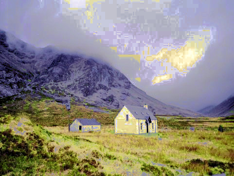

# colour transfer

This package contains two scripts to run colour grading as described in

```
[Pitie05a] N-Dimensional Probability Density Function Transfer and its
Application to Colour Transfer. F. Pitie , A. Kokaram and
R. Dahyot (2005) In International Conference on Computer Vision
(ICCV'05). Beijing, October.

[Pitie05b] Towards Automated Colour Grading.
F. Pitié , A. Kokaram and R. Dahyot (2005) In 2nd IEE European
Conference on Visual Media Production (CVMP'05).
London, November.

[Pitie07a] Automated colour grading using colour distribution transfer.
F. Pitie , A. Kokaram and R. Dahyot (2007)
Computer Vision and Image Understanding.

[Pitie07b] The linear Monge-Kantorovitch linear colour mapping
for example-based colour transfer.
F. Pitié and A. Kokaram (2007) In 4th IEE European
Conference on Visual Media Production (CVMP'07).
London, November.
```

The grain reducer technique of [Pitie05b] and [Pitie07a] is not provided here.
Note that both pictures are copyrighted but can be freely used for research
purposes.

Send an email to fpitie@mee.tcd.ie if you want more information

## Example

```Matlab
I0 = double(imread('scotland_house.jpg'))/255;	 % reference image
I1 = double(imread('scotland_plain.jpg'))/255;   % target palette
IR_idt = colour_transfer_IDT(I0, I1, 20);        % [Pitie07a,Pitie05a,Pitie05b]
IR_mkl = colour_transfer_MKL(I0, I1);     	   	 % [Pitie07b]
```


<table style="width:100%">
<tr>
<td></td>
<td></td>
</tr>
<tr>
<td>input ref</td>
<td>input target</td>
</tr>
<tr>
<td></td>
<td></td>
</tr>
<tr>
<td>Linear Monge-Kantorovitch solution</td>
<td>IDT Solution</td>
</tr>
</table>

